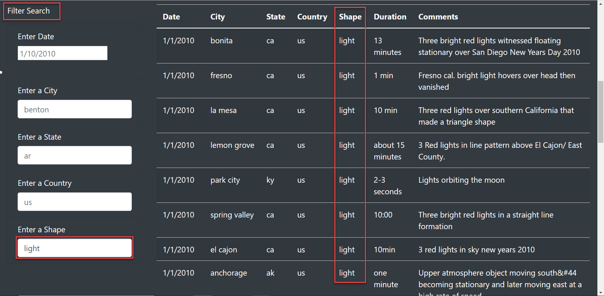

# UFOs

## Overview:
The purpose of this analysis is to delve into the world of JavaScript. An analysis of its technical aspects and how it applies to the field of data analytics and visualization will be explored. We are tasked with utilizing JavaScript to design a webpage that will accept user input and then sort and filter UFO sightings based on date, city, country, date, and state. 

## Results:

There are several different search criteria that are available for users to sort and filter the data on the webpage. Data can be sorted by Date, City, State, Country, or Shape of UFO. We will use an example of filtering by ‘Shape’ to explain how the filtering process works. 

1)	Users will navigate to the ‘Filter Search’ section of the webpage.
2)	Users will determine which filter(s) should be applied to the results. Users should the enter the parameters in the appropriate field(s). 

      a.**Note:** In this example, ‘light’ was used as the filter for Shape
3)	User can press tab or click anywhere on the screen to view filtered results. 

      a.**Note:** Notice that only UFO Shapes matching the description of ‘light’ is displayed in the filtered results. 

4)	To reset or start a new search, click “UFO Sighting” in the upper left section of the screen. 

## Summary:
One drawback of this new design is that data in the filter search must be entered manually and it must match the case and format in the fields exactly or the search will not return any results. 
Two recommendations for further development are using a drop-down menu in the filter search so that users can easily view all available options for each filter. The second recommendation would be to include an interactive map that would be updated based on the filters. 
